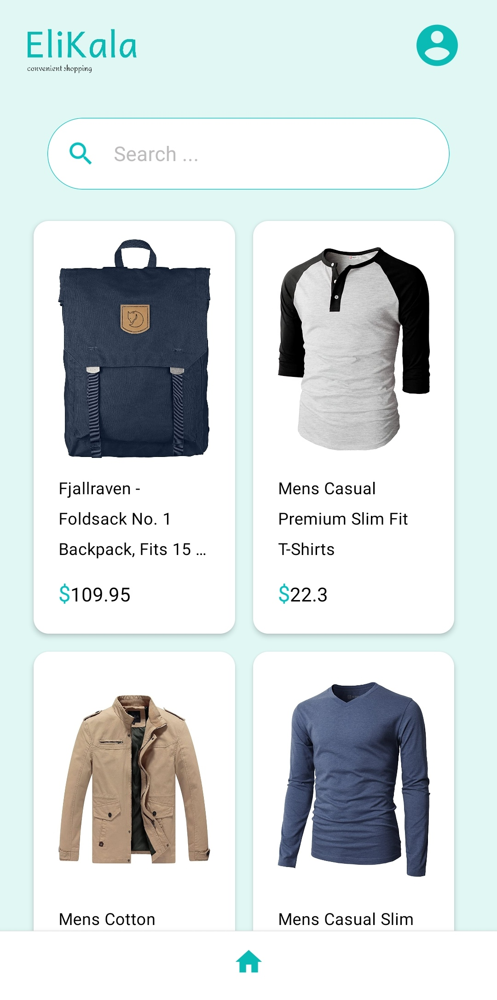
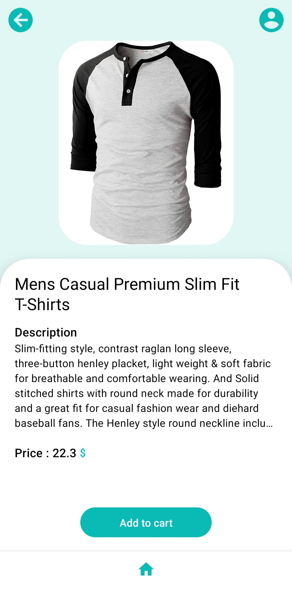

# AwesomeProject
# Elikala

AwesomeProject, branded as Elikala, is a small app designed for convenient shopping. It fetches items from an API and provides a user-friendly interface for browsing and viewing item details.


## Features

- **Home Page**: Fetches items from the API, includes a search filter based on the items, and supports pull-to-refresh functionality.
- **Navigation**: Allows users to select items and navigate to the details page for more information.

## Screenshots

### Home Page


### Detail Page


## Download AwesomeProject

The latest version of AwesomeProject can be downloaded from the [Releases](https://github.com/Elaheh-sh97/Store-App/releases) section.


## Installation

### Prerequisites

- Android Studio installed on your development machine.
- An Android device or emulator.

### Steps

1. Clone the repository:

    ```bash
    git clone https://github.com/Elaheh-sh97/Store-App.git
    cd AwesomeProject
    ```

2. Open the project in Android Studio.

3. Build the project and run it on an Android device or emulator.

## Usage

### Home Page

- **Fetching Items**: When you open the app, the home page will automatically fetch the latest items from the API.
- **Search Filter**: Use the search bar at the top of the home page to filter items based on keywords. Start typing, and the list of items will update in real-time based on your input.
- **Pull to Refresh**: Pull down on the list of items to refresh and fetch the latest data from the API.

### Navigation

- **Viewing Item Details**: Tap on any item in the list to navigate to the details page. Here you will find more information about the selected item.
- **Back Navigation**: Use the back button on your device or the back arrow in the app's navigation bar to return to the home page.

## API

*GET https://fakestoreapi.com/products*

## Contact

*elahe.sh76@gmail.com*
